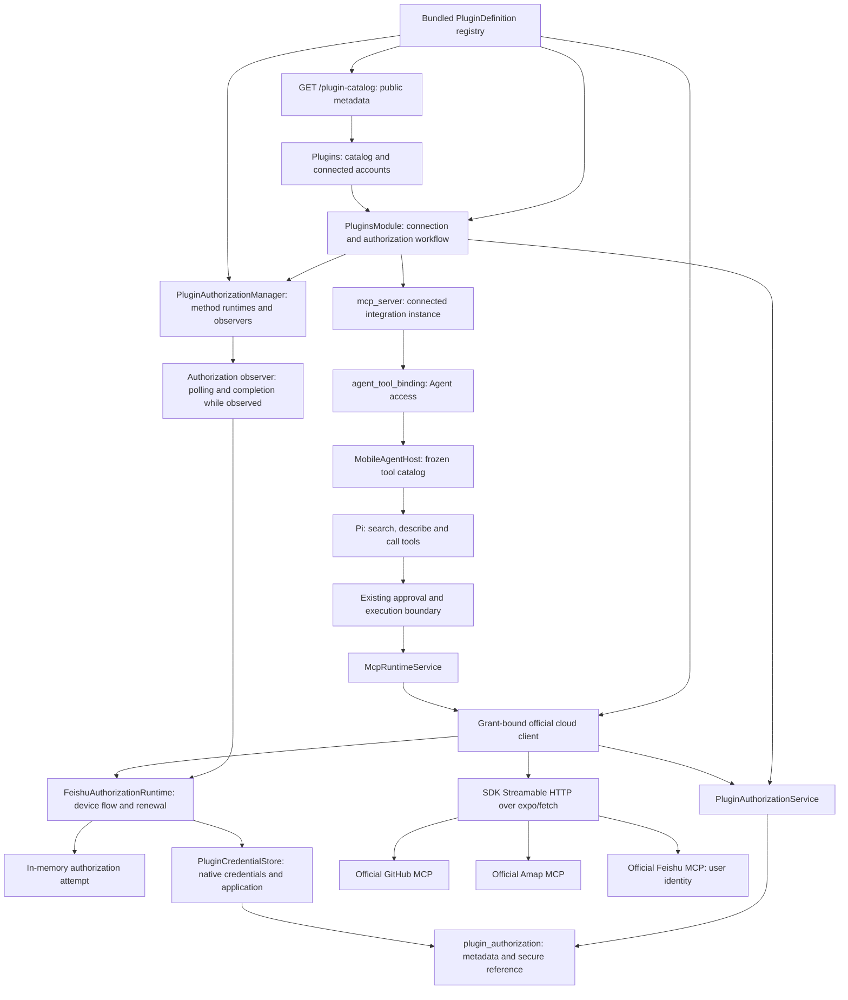

# Built-In MCP Integrations

> Status (2026-09-10): as-built reference for GitHub, Amap and Feishu. All three connect directly
> to official hosted MCP services; no self-hosting is required. Feishu supports browser-based user
> authorization with a newly registered or an existing application and user-token renewal
> for six document tools. Regression coverage for the authorization-method
> and SQLite changes was updated but has not been run in this session. The Feishu user flow has
> no device or live-account acceptance yet. Canva, Gmail, Yuque, multiple
> accounts and other providers' OAuth remain planned. Proposed designs that are not implemented
> live in [Built-In MCP Roadmap](./built-in-mcp-roadmap.md); availability research is in
> [Plugin Expansion Research](./plugin-expansion-research.md).

## Plugins

The product entry is **Plugins** in the chat drawer. Each plugin has a detail page, capability and
privacy information, and an explicit **Add** action before authorization. Connecting does not
enable every Agent: the user selects an Agent to enable the plugin and start a conversation.
Remote MCP servers remain in Settings; connected plugins also participate in Agent tool settings.

| Integration | Implemented authorization | Implemented tools |
| --- | --- | --- |
| GitHub | User-supplied personal access token; read-only `get_me` validation | `get_me`, `search_repositories`, `search_issues`, `search_pull_requests`, `get_file_contents`, `list_pull_requests`, `issue_read`, `pull_request_read`, `issue_write`, `add_issue_comment`, `create_pull_request` |
| Amap | User-supplied Web Service key; read-only Beijing `maps_weather` validation | `maps_text_search`, `maps_around_search`, `maps_geo`, `maps_regeocode`, `maps_direction_driving`, `maps_direction_walking`, `maps_direction_transit_integrated`, `maps_weather` |
| Feishu | Browser-confirmed user authorization with an application configured on the Feishu page or credentials entered manually. Setup checks account identity, scopes and `fetch-doc` discovery without a business-tool call | `fetch-doc`, `list-docs`, `get-comments`, `create-doc`, `update-doc`, `add-comments` |

### Official Cloud Coverage

GitHub's hosted endpoint is `https://api.githubcopilot.com/mcp/`, authenticated with a Bearer token.
Amap's is `https://mcp.amap.com/mcp?key=...`. Feishu's is `https://mcp.feishu.cn/mcp`, authenticated
with `X-Lark-MCP-UAT` for the authorized user. All use the existing
SDK's Streamable HTTP transport. The Amap key is injected only when sending a request; the SDK
endpoint and saved server identity contain no key. Routing is fixed in backend code and redirects
cannot forward credentials elsewhere. GitHub also receives `X-MCP-Tools` for the admitted subset;
Cherry enforces the allowlist locally for all three services, independently of upstream behavior.
Feishu also receives `X-Lark-MCP-Allowed-Tools`; user-only search and unrelated API domains are not
admitted.

| Former capability | Official replacement | Difference |
| --- | --- | --- |
| GitHub profile, repository search, file reads, PR listing | `get_me`, `search_repositories`, `get_file_contents`, `list_pull_requests` | Upstream schemas and result shapes |
| GitHub issue/PR search | `search_issues`, `search_pull_requests` | Separate tools |
| GitHub issue/PR detail | `issue_read`, `pull_request_read` | Upstream `method` selects the read operation |
| GitHub issue creation | `issue_write` | Supports creation and updates; requires renewed Agent consent |
| GitHub comments and PR creation | `add_issue_comment`, `create_pull_request` | Existing-branch PR workflow retained |
| Amap place and nearby search | `maps_text_search`, `maps_around_search` | Former pagination inputs are not guaranteed |
| Amap address/coordinate conversion | `maps_geo`, `maps_regeocode` | Upstream schemas and result shapes |
| Amap driving, walking and transit | `maps_direction_driving`, `maps_direction_walking`, `maps_direction_transit_integrated` | Longitude-first GCJ-02 coordinates |
| Amap weather | `maps_weather` | Forecast-oriented; no promise of the former live/forecast switch |
| Amap administrative districts | None in the documented cloud catalog | Removed; no local REST fallback |

This covers GitHub's previous workflows and eight of Amap's nine capability categories. The official
catalogs own business behavior; Cherry does not translate old calls or duplicate their schemas.
Newly published upstream tools require an explicit code admission decision. A missing or incompatible
tool is unavailable, not an invitation to fall back to the deleted local implementation.

Migration `0022_official-cloud-plugins` disables existing GitHub/Amap Agent bindings while retaining
credentials, server UUIDs, old per-tool selections, approval settings, disabled tools and history.
Users review and re-enable access; old per-tool identities are not retargeted automatically. Custom
MCP servers are unchanged. The plugin detail page explains the cloud destination and re-enable step.

The merged sequence preserves v0.2's `0020_desktop-connection`, followed by
`0021_plugin-authorizations`. Migration `0023_reconcile-desktop-connection` also creates the desktop
table if absent: earlier plugin development installs can have a newer migration timestamp without
that table. Migration `0024_extensible-plugin-authorizations` removes the old platform/method
enumeration while preserving grants, server identities, disabled tools and Agent bindings, including
when foreign keys stay enabled inside the migration transaction. Platform registration no longer
changes SQL.

Sources: [GitHub remote service](https://github.com/github/github-mcp-server/blob/main/docs/remote-server.md),
[GitHub tools](https://github.com/github/github-mcp-server),
[Amap hosted setup](https://lbs.amap.com/api/mcp-server/gettingstarted),
[Amap capabilities](https://lbs.amap.com/api/mcp-server/summary). Amap's official
`@amap/amap-maps-mcp-server@0.0.8` distribution corroborates tool names and forecast output; it is
source evidence, not a bundled dependency or proof of live remote schema parity.

### Grants And Connections

The `plugin_authorization` table stores plugin ID, authorization method, account label, an opaque
`credential` reference and timestamps. `PluginCredentialStore`, owned by the authorization manager,
keeps plugin secrets in `expo-secure-store` with `WHEN_UNLOCKED_THIS_DEVICE_ONLY` and no biometric
prompt. Credentials are local to this installation and do not participate in sync. This policy is
specific to plugins; provider API keys and remote MCP headers are outside this change.
Backend types distinguish `PluginSecretReference` in the database schema from `PluginCredential`
and resolved `PluginGrant` in `builtInMcp/authorization`. The database service accepts
`credentialReference`; the native store accepts secret values as `credential`. The SQL column is
still named `credential`, so this distinction changes no persisted format.
Each authorization method owns and validates its versioned object before native persistence:
GitHub stores `{ version: 1, token }`, Amap stores `{ version: 1, key }`, and Feishu user authorization stores
`{ version: 1, application, tokens }`. Token values, scope and expiration metadata belong inside
that object; adding an authorization field does not add a database column.

Reusable application information and completed grants occupy separate native items. Browser
challenges and uncommitted user credentials stay in the method runtime's memory. Leaving the page
keeps the attempt within the same process; restarting the app requires starting authorization again.

Completion saves the native credential first, then commits its reference and MCP connection in
SQLite. Failure is reported for the user to retry the flow. Replacement and disconnect delete known
obsolete native items on a best-effort basis; SQLite determines which authorization is usable.
There is no legacy credential import, startup migration, orphan scan or persistence-retry journal.

`PluginAuthorizationService` commits each grant and its MCP reference together. Updating
authorization preserves the server UUID but allocates a new grant identity; disconnecting disables
existing Agent bindings, deletes the server and grant, and invalidates active calls. Reconnecting
after disconnect requires explicit Agent enablement. Credentials stay out of frontend query caches
and tool arguments.

Catalog metadata comes from `GET /plugin-catalog`; connection metadata comes from
`GET /plugin-connections` on the Data API. The `PluginsModule` owns connect/disconnect and the
interactive authorization surface: observe, check, begin, use an existing application, cancel and
reset application. Every action selects both a plugin and an authorization method. Shared plugin entities live under `shared/data/types`; the MCP runtime's
connection configuration remains backend-private.

`createBuiltInMcpClient` resolves a registered plugin and checks its stored authorization method.
`createOfficialMcpClient` supplies the shared HTTP transport and rechecks the referenced grant
before every network request, propagates cancellation, and does not replay writes. There is no
transport-level `authProvider`, so a `401` cannot trigger a resend. HTTP errors expose only safe
diagnostics; ambiguous submitted writes tell the caller to check the service before retrying. Input
validation and result-size limits remain in the existing MCP runtime. GitHub token permissions and
Amap quota/access restrictions remain upstream authority. No device-location grant is requested.

### Feishu Browser Authorization

`McpRuntimeService` owns `PluginAuthorizationManager`, which creates and stops one runtime and
observer per registered interactive method. Feishu supplies `FeishuAuthorizationRuntime`. It performs one step per
call and keeps no timers. A backend authorization observer schedules those steps: while at least one
screen observes, it polls at the server's interval (increased on `slow_down`, bounded by the
original expiry), completes an approved attempt once, and pushes the state, progress and outcome to
the screen. Detaching stops scheduling only; the attempt stays in memory for the next visit
within the same process. The connection screen observes while it is focused and the app is active, and asks
for one immediate check when the browser closes. No Cherry callback is promised: users return
manually after each official confirmation, and browser close is a check, not a success or denial
guess.

The primary application entry uses the official `PersonalAgent` flow to open the Feishu page.
That page offers eligible custom applications owned or administered by the signed-in user; it hides
the existing-application selector when its filtered list is empty or the URL requests creation only.
Cherry saves the returned application credentials before the separate user grant. The secondary
entry explicitly offers manual entry of an existing application's ID and secret, validated by the
method's field rules. Both entries authorize the personal account. The application is kept across cancellation,
failed user authorization and disconnect, so a later authorization never registers another
application in Feishu. An explicit, confirmed recovery action forgets the saved application
without dropping a live grant. The official page may retain CLI wording and require organization
approval; Cherry sends no invented CLI version or third-party brand alias. Only domestic Feishu
accounts are supported; cross-brand Lark handoff is rejected.

The requested scopes are the union for the six tools plus `offline_access`. Task/chat, contact,
media and board scopes are dependencies of those document tools, not new tool offerings. Connection
requires every document scope in the returned set and names the missing ones; renewal capability
is proven by an issued refresh token rather than an echoed `offline_access` scope. Partial grants
cannot connect and no partially enabled catalog is advertised. Profile lookup and MCP discovery
follow authorization, so merely holding application credentials is not connection success.

One method queue serializes exchanges, renewal, persistence and grant commits. Explicit
authorization cancellation invalidates the attempt before late work can commit. Ordinary tool-call
cancellation only releases that caller's wait: shared renewal uses the runtime and grant lifetime,
continues for other callers, and saves the returned token object even when every caller has left.
Concurrent callers share the same pending result, including failures. Disconnect, successful grant
replacement and host disposal invalidate the old renewal owner.

Renewal replaces one native item under a stable reference after checking the grant ID
in the manager-owned storage queue. It requires no second SQLite write and
cannot recreate a deleted row or overwrite a replacement. The grant ID remains stable during
ordinary rotation; the HTTP transport rechecks that ID and authorization method after credential
resolution and before sending. Updating a token therefore does not itself invalidate the connection.
A failed save is reported and requires the user to authorize again; no issued result is retained for
an automatic persistence retry. Disconnect removes local authorization and disables Agent bindings;
it keeps the application and does not revoke consent at Feishu.

Live iOS/Android login, organization approval, process interruption and actual token renewal still
need user-authorized acceptance. The public registration mechanism's support for Cherry as a
third-party mobile client is not established by source inspection alone.

Protocol references: [official registration](https://github.com/larksuite/cli/blob/9aaedb981b036ca94bd8ec9c630adf0ead9b6d1c/internal/auth/app_registration.go),
[device authorization](https://github.com/larksuite/cli/blob/9aaedb981b036ca94bd8ec9c630adf0ead9b6d1c/internal/auth/device_flow.go),
[user-token renewal](https://github.com/larksuite/cli/blob/9aaedb981b036ca94bd8ec9c630adf0ead9b6d1c/internal/auth/uat_client.go).

The `development-simulator` EAS profile builds an ARM64 development client: the currently pinned
Anydoc native dependency provides only an ARM64 simulator slice. It is a simulator `.app` archive,
not an installable physical-device IPA.

## Extensible Plugin Definitions

`PluginDefinition` is the single bundled extension contract. `pluginRegistry.ts` registers the
GitHub, Amap and Feishu definitions from `plugins/`. Each definition owns:

- A stable `catalog.id`, links, an optional icon name and the saved MCP
  server name. Display copy is not in the definition: every user-facing string for a plugin lives
  in the locale files under `plugins.catalog.<id>`, alongside the rest of the application's copy.
- An ordered `authMethods` collection. Each method has its own stable ID, form fields or interactive
  stages, credential codec or runtime factory, and request-authorization factory. The first method
  is the default; the connection page offers every other registered method.
- `createClient`, which receives the credential resolver, grant recheck, method-owned request
  authorization, cancellation signal and admitted tool policy.
- Reviewed tool names classified as `read` or `write`, plus a read-only connection validation rule.

The [module directory map](../../../src/backend/services/builtInMcp/README.md#file-ownership)
defines implementation placement: common authorization lives in `authorization/`, client and
connection validation in `transport/`, and all Feishu-specific code in `plugins/feishu/`.

The database stores open strings for `pluginId` and `authMethod`. SQL checks only that they are
nonempty; it still preserves foreign keys, remote/built-in source constraints and the single
connection per plugin index. The serialized MCP schema validates identifier syntax rather than
listing provider names. Runtime availability is a separate decision: only registered definitions
can create clients or admit tools, and a stored grant must match one of that definition's auth
methods. Unknown definitions are retained in storage and shown as unavailable; their connections
can be disconnected. They cannot execute, even when an old Agent binding still exists.

`GET /plugin-catalog` exposes a detached, JSON-only projection of the same definitions. It includes
no credential, auth implementation or client factory. The list, detail and connection pages derive
from that projection and translate its identifiers. Credential fields declare secret display,
maximum length and an optional pattern; `createPluginCredentialsSchema` derives strict validation
for both the form and backend workflow. Credential forms remain generic. Unknown icon names use a
generic document icon.

Interactive methods are part of the same registry. The manager looks up a method's runtime
factory; workflows and screens contain no provider-name branches. The shared state exposes a
provider-owned stage string, and `InteractiveConnect` renders the declared stages and localized
copy. Existing-application entry is an optional method capability. Manual forms use the selected
method's field rules. Generic action copy lives under `plugins.authorization`; plugin and method
copy lives only under `plugins.catalog.<id>`, with method copy under `authMethods.<methodId>`.

To add another hosted MCP plugin or authorization method:

1. Add a definition under `src/backend/services/builtInMcp/plugins/`, with its links, methods,
   reviewed tools, read-only setup check and locale copy. Methods declare either credential fields
   and an encoder or interactive stages and a runtime factory. Keep a provider's private clients,
   credential schemas, authorization runtime and tests in its own directory once it spans files.
2. Reuse `createOfficialMcpClient` with a fixed official endpoint. Each method provides its own
   credential injection. A renewable method implements `resolveCredential` and owns its renewal
   lifetime and persistence through the scoped authorization store.
3. Register the plugin once in `pluginRegistry.ts`, or add a method to an existing definition.
   The catalog, method selector, persistence and runtime manager consume it without provider
   switches. Current interactive presentation covers browser confirmation and polling; callback
   or native SDK interactions remain additional capability work in the roadmap.
4. Cover the authorization, validation and tool boundary. Run cloud/device acceptance only when
   explicitly authorized.

Keep plugin IDs and auth-method identifiers stable across releases. Version credential objects
inside their owning methods and migrate old formats explicitly. Shared storage only validates the
JSON object boundary. Display-name or tool-catalog edits do not justify changing a durable ID.

This is bundled code registration, not downloaded executable plugins. The `createClient` boundary
can later host an in-process adapter without adding provider switches to storage or screens.

## Scope

Cherry Mobile plans six integrations in its Plugins directory. A user connects an account, chooses
which Agent may use it, and then uses its tools through ordinary conversation. The application owns
authorization and tool orchestration on the device; official MCP services execute their business
tools remotely. Feishu user grants renew on demand; other OAuth providers remain later slices. No
Cherry-operated authorization proxy, command-line program, local HTTP listener, or desktop process
is required by this design.

GitHub, Amap and Feishu document tools use official remote MCP services; Canva and Gmail are planned
to use that route after their access and authorization prerequisites are met. Yuque and broader
Feishu business domains retain their proposed direct-API designs. All enter the existing MCP
discovery, binding, approval, and result pipeline. Canva is an explicit upstream MCP dependency, not
a claim that its Connect REST API supports a secretless mobile client.

| Region | Integration ID | Initial useful tools | Execution and authorization |
| --- | --- | --- | --- |
| International | `github` | Search repositories; read files; list/read issues and pull requests; create/update issues and comments | Official hosted MCP with a personal token. Interactive authorization remains future work. [Remote service](https://github.com/github/github-mcp-server/blob/main/docs/remote-server.md) |
| International | `canva` | Search/read designs; generate a candidate and create a design; export a design | Planned remote MCP connector, pending callback approval and user OAuth. Preserve upstream names such as `search-designs`, `get-design`, `generate-design`, `create-design-from-candidate`, and `export-design`. [Tool catalog](https://www.canva.dev/docs/mcp/tools/) |
| International | `gmail` | Search/read threads; create drafts; modify labels | Planned official hosted MCP after Developer Preview access and mobile OAuth setup. Sending drafts is not in the current official MCP catalog. [Official setup](https://developers.google.com/workspace/gmail/api/guides/configure-mcp-server) |
| China | `amap` | Search places; search nearby; geocode; plan a route; weather forecasts | Official hosted MCP with a user-supplied Web Service key. [Getting started](https://lbs.amap.com/api/mcp-server/gettingstarted) |
| China | `yuque` | Search/read documents; list knowledge books; create/update documents | Local functions and OpenAPI with a user-supplied personal or space token. [Official API client](https://github.com/yuque/yuque-open-cli/blob/main/README.zh-CN.md) |
| China | `feishu` | Current: read/create/update documents, browse knowledge-space nodes and read/add comments. Planned: personal search, Base records, calendars and tasks | Official developer MCP with browser user authorization. Live user-flow acceptance and curated OpenAPI functions remain pending. [Official developer MCP](https://open.feishu.cn/document/mcp_open_tools/developers-call-remote-mcp-server) |

Future local integrations may use Cherry-owned names such as `read_document`; remote integrations
preserve official names. Full API coverage, local file uploads/downloads, Feishu messaging, Canva
editing transactions, and permanent deletion operations are later capability slices. All six
platforms remain in the plan regardless of delivery order.

## Architecture

The [current tool architecture](./agent-tools-and-resources.md) remains authoritative for shipped
behavior. Pi owns the only model/tool loop, the Host freezes executable tools per turn, and MCP
tools already use `tool_search`, `tool_describe`, and `tool_call`.

There are three durable facts with different owners:

1. A bundled definition describes an integration, its endpoint and admitted tools. Definitions ship in
   code and are not copied into a database catalog.
2. An authorization records a particular account/grant and its credentials. It does not enable
   tools or assign them to Agents.
3. An MCP server instance connects a definition to an authorization. Existing Agent bindings decide
   which of that instance's tools may enter a turn.

Connecting an account and enabling an integration for an Agent are separate actions. Settings may
offer them together, but connecting never silently grants every Agent access.

Every plugin tool keeps the existing identity `{ source: 'mcp', serverId, rawToolName }`, so it
inherits current aliasing, discovery, binding, approval, audit and history behavior. The `builtin`
ToolRef variant remains reserved for the device/system capability catalog. The Host freezes the
tool snapshot with its callback per turn; execution rechecks the grant before touching the
platform. Changing accounts, reconnecting a different grant, disconnecting, or reducing permissions
invalidates the old connection. Ordinary token renewal for the same grant does not. Settings edits
apply to the next turn; a revoked grant stops further calls in the current turn. An already
submitted remote operation cannot be rolled back merely by cancelling locally.

All integrations retain the current base MCP `ask` policy and existing Agent approval-mode rules.
Provider annotations are descriptive hints, not authorization. User-selected automatic approval
can reduce routine prompts through the current mechanism; connecting an account does not itself
grant automatic approval. GitHub, Amap and Feishu use a reviewed subset of discovered upstream
tools; upstream names and schemas remain intact, and new upstream tools do not become enabled
merely because discovery starts returning them.
