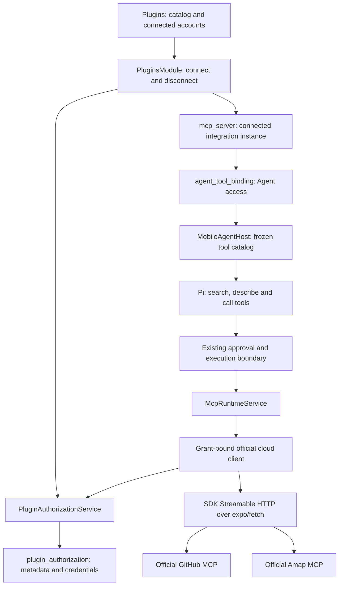

# Built-In MCP Integrations

> Status (2026-09-09): GitHub and Amap now connect directly to their official hosted MCP services.
> Their handwritten business tools and in-process MCP transport have been removed. No self-hosting
> is required. Coverage is based on official documentation/source, not authenticated cloud calls.
> Regression tests are updated but not executed; the new cloud flow has no device acceptance yet.
> Earlier iOS evidence belongs to the superseded local implementation. Canva, Gmail, Yuque, Feishu,
> multiple accounts and renewable OAuth authorization remain planned.

## First Delivery: Plugins

The product entry is **Plugins** in the chat drawer. Each plugin has a detail page,
capability and privacy information, and an explicit **Add** action before authorization. Connecting
does not enable every Agent: the user selects an Agent to enable the plugin and start a conversation.
Remote MCP servers remain in Settings; connected plugins also participate in Agent tool settings.

| Integration | Implemented authorization | Implemented tools |
| --- | --- | --- |
| GitHub | User-supplied personal access token; read-only `get_me` validation | `get_me`, `search_repositories`, `search_issues`, `search_pull_requests`, `get_file_contents`, `list_pull_requests`, `issue_read`, `pull_request_read`, `issue_write`, `add_issue_comment`, `create_pull_request` |
| Amap | User-supplied Web Service key; read-only Beijing `maps_weather` validation | `maps_text_search`, `maps_around_search`, `maps_geo`, `maps_regeocode`, `maps_direction_driving`, `maps_direction_walking`, `maps_direction_transit_integrated`, `maps_weather` |

### Official Cloud Coverage

GitHub's hosted endpoint is `https://api.githubcopilot.com/mcp/`, authenticated with a Bearer token.
Amap's is `https://mcp.amap.com/mcp?key=...`. Both use the existing SDK's Streamable HTTP transport.
The Amap key is injected only when sending a request; the SDK endpoint and saved server identity
contain no key. Routing is fixed in backend code and redirects cannot forward credentials elsewhere.
GitHub also receives `X-MCP-Tools` for the admitted subset; Cherry enforces the allowlist locally for
both services, independently of upstream behavior.

| Former capability | Official replacement | Difference |
| --- | --- | --- |
| GitHub profile, repository search, file reads, PR listing | `get_me`, `search_repositories`, `get_file_contents`, `list_pull_requests` | Upstream schemas and result shapes |
| GitHub issue/PR search | `search_issues`, `search_pull_requests` | Separate tools |
| GitHub issue/PR detail | `issue_read`, `pull_request_read` | Upstream `method` selects the read operation |
| GitHub issue creation | `issue_write` | Supports creation and updates; requires renewed Agent consent |
| GitHub comments and PR creation | `add_issue_comment`, `create_pull_request` | Existing-branch PR workflow retained |
| Amap place and nearby search | `maps_text_search`, `maps_around_search` | Former pagination inputs are not guaranteed |
| Amap address/coordinate conversion | `maps_geo`, `maps_regeocode` | Upstream schemas and result shapes |
| Amap driving, walking and transit | `maps_direction_driving`, `maps_direction_walking`, `maps_direction_transit_integrated` | Longitude-first GCJ-02 coordinates |
| Amap weather | `maps_weather` | Forecast-oriented; no promise of the former live/forecast switch |
| Amap administrative districts | None in the documented cloud catalog | Removed; no local REST fallback |

This covers GitHub's previous workflows and eight of Amap's nine capability categories. The official
catalogs own business behavior; Cherry does not translate old calls or duplicate their schemas.
Newly published upstream tools require an explicit code admission decision. A missing or incompatible
tool is unavailable, not an invitation to fall back to the deleted local implementation.

Migration `0022_official-cloud-plugins` disables existing GitHub/Amap Agent bindings while retaining
credentials, server UUIDs, old per-tool selections, approval settings, disabled tools and history.
Users review and re-enable access; old per-tool identities are not retargeted automatically. Custom
MCP servers are unchanged. The plugin detail page explains the cloud destination and re-enable step.

The merged sequence preserves v0.2's `0020_desktop-connection`, followed by
`0021_plugin-authorizations`. Migration `0023_reconcile-desktop-connection` also creates the desktop
table if absent: earlier plugin development installs can have a newer migration timestamp without
that table. This reconciliation preserves existing desktop pairings and plugin data.

Sources: [GitHub remote service](https://github.com/github/github-mcp-server/blob/main/docs/remote-server.md),
[GitHub tools](https://github.com/github/github-mcp-server),
[Amap hosted setup](https://lbs.amap.com/api/mcp-server/gettingstarted),
[Amap capabilities](https://lbs.amap.com/api/mcp-server/summary). Amap's official
`@amap/amap-maps-mcp-server@0.0.8` distribution corroborates tool names and forecast output; it is
source evidence, not a bundled dependency or proof of live remote schema parity.

The current `plugin_authorization` table stores the integration, static authorization method,
account label, the credential as entered, and timestamps. The credential is not encrypted at rest:
provider API keys and remote MCP headers already live unencrypted in the same sandboxed SQLite
database, and a plugin-only encryption layer would not raise that baseline while adding a native
dependency and a second store to keep consistent. No refresh-token or expiry behavior is claimed
for this first delivery. The larger authorization schema below is the target for later OAuth
slices, not the current schema.

`PluginAuthorizationService` commits each grant and its MCP reference together. Updating authorization
preserves the server UUID but allocates a new grant identity; disconnecting disables existing Agent
bindings, deletes the server and grant, and invalidates active calls. Reconnecting after disconnect
requires explicit Agent enablement. Credentials stay out of frontend query caches and tool arguments.

Connection metadata is read through the Data API's `GET /plugin-connections` endpoint. The
`PluginsModule` workflow contract owns only connect and disconnect; shared plugin entities live
under `shared/data/types`, and the MCP runtime's connection configuration remains backend-private.

`createBuiltInMcpClient` creates an account-bound official HTTP client, rechecks the referenced grant
before every network request, propagates cancellation, and does not replay writes. There is no
transport-level `authProvider`, so a `401` cannot trigger a resend. HTTP errors expose only safe
diagnostics; ambiguous submitted writes tell the caller to check GitHub before retrying. Input
validation and result-size limits remain in the existing MCP runtime. GitHub token permissions and
Amap quota/access restrictions remain upstream authority. No device-location grant is requested.

The `development-simulator` EAS profile builds an ARM64 development client: the currently pinned
Anydoc native dependency provides only an ARM64 simulator slice. It is a simulator `.app` archive,
not an installable physical-device IPA.

## Follow-Up PR: Plugin Instruction Resources

The current PR delivers the basic plugin UI, authorization lifecycle, official cloud tool integration,
and required migrations. It does not deliver plugin workflow guides, Markdown resource loading,
dynamic instruction injection, or task shortcuts. Implement the instruction layer in a separate PR,
following the existing [Agent Skills boundary](./agent-skills.md), without expanding MCP permissions.

Follow-up TODOs:

- [ ] Define one plugin-owned instruction resource contract and directory convention. Keep stable
  plugin metadata and its Markdown resource together, with one source of truth; settle exact paths
  and file naming during implementation rather than creating a parallel registry.
- [ ] Specify the mobile Markdown subset, bundled-resource delivery, source/revision attribution,
  encoding, size limits, ordering, and handling of missing or invalid content. Start with bundled
  instruction text, not downloaded code, scripts, hooks, arbitrary file access, or a general importer.
- [ ] Resolve guides when a plugin enters the current Agent's available capabilities for a turn,
  not when the app starts or an MCP connection happens to open. The Host prepares an immutable
  instruction snapshot alongside the tool snapshot; it does not mutate the Agent's saved prompt or
  repeatedly append guides to chat history.
- [ ] Define disablement, disconnection, unavailable-tool, and update behavior. Re-evaluate selection
  on the next turn, preserve current-turn isolation, and retain existing immediate tool-revocation
  checks. Guides cannot grant capabilities or override application safety rules or user instructions.
- [ ] Ship concise GitHub and Amap workflow guides through the shared loader, with coverage for
  Agent isolation, duplicate injection, resource validation, updates, and disabled/unavailable
  plugins. Keep the first delivery independent of a general Skill manager or new persistence tables.

Task shortcuts are a separate optional follow-up; they are not a prerequisite for instruction loading.
Visual workflow editing, background scheduling, executable extensions, and a third-party plugin
marketplace are outside this follow-up's initial scope.

## Broader Roadmap And Scope

Cherry Mobile plans six integrations in its Plugins directory. A user connects an account, chooses
which Agent may use it, and then uses its tools through ordinary conversation. The application owns
authorization and tool orchestration on the device; official MCP services execute their business
tools remotely. Credential renewal belongs to future OAuth slices. No
Cherry-operated authorization proxy, command-line program, local HTTP listener, or desktop process
is required by this design.

GitHub and Amap use official remote MCP services; Canva is planned to use the same route. Gmail,
Yuque and Feishu retain their proposed direct-API designs pending a separate connector assessment.
All enter the existing MCP discovery, binding, approval, and result pipeline. Canva is an explicit
upstream MCP dependency, not a claim that its Connect REST API supports a secretless mobile client.

The initial scope is:

| Region | Integration ID | Initial useful tools | Execution and authorization |
| --- | --- | --- | --- |
| International | `github` | Search repositories; read files; list/read issues and pull requests; create/update issues and comments | Official hosted MCP with a personal token. Interactive authorization remains future work. [Remote service](https://github.com/github/github-mcp-server/blob/main/docs/remote-server.md) |
| International | `canva` | Search/read designs; generate a candidate and create a design; export a design | Bundled remote MCP connector. Preserve upstream names such as `search-designs`, `get-design`, `generate-design`, `create-design-from-candidate`, and `export-design`. [Tool catalog](https://www.canva.dev/docs/mcp/tools/) |
| International | `gmail` | Search messages; read threads; create drafts; send a draft; modify labels | Local functions and Gmail API, with separate iOS and Android authorization adapters. [Native OAuth](https://developers.google.com/identity/protocols/oauth2/native-app), [Android authorization](https://developer.android.com/identity/authorization) |
| China | `amap` | Search places; search nearby; geocode; plan a route; weather forecasts | Official hosted MCP with a user-supplied Web Service key. [Getting started](https://lbs.amap.com/api/mcp-server/gettingstarted) |
| China | `yuque` | Search/read documents; list knowledge books; create/update documents | Local functions and OpenAPI with a user-supplied personal or space token. [Official API client](https://github.com/yuque/yuque-open-cli/blob/main/README.zh-CN.md) |
| China | `feishu` | Search/read documents; list/query/update Base records; query/create calendar events; create tasks | Local functions and OpenAPI. Adapt the official personal-agent authorization path, subject to mobile support and tenant policy. [Official authorization source](https://github.com/larksuite/cli/blob/main/internal/auth/app_registration.go) |

Future local integrations may use Cherry-owned names such as `read_document` and `create_draft`;
remote integrations preserve official names. Full API coverage, local file
uploads/downloads, Feishu messaging, Canva editing transactions, and permanent deletion operations
are later capability slices. All six platforms remain in the plan regardless of delivery order.

## Existing Foundation And Required Changes

The [current tool architecture](./agent-tools-and-resources.md) remains authoritative for shipped
behavior. In particular, Pi owns the only model/tool loop, the Host freezes executable tools per
turn, and MCP tools already use `tool_search`, `tool_describe`, and `tool_call`.

| Existing owner | Reuse | Required extension |
| --- | --- | --- |
| `McpRuntimeService` | Client lifetime, paginated discovery, invocation, invalidation and cancellation | Select a custom remote or fixed official cloud connection; attach authorization without storing tokens in connection headers |
| `mcp_server` and `agent_tool_binding` | Server UUIDs, tool enablement, Agent bindings, approval and dangling identities | Add an explicit built-in server variant and its authorization reference; keep binding identities unchanged |
| `mcpRuntimeAdapter` | Input validation, deterministic aliases, result bounds and Runtime callbacks | Replace its URL-only connection identity with a source-aware identity |
| `MobileAgentHost` and Pi | Frozen catalog, approvals, events, transcript and deferred tool discovery | Consume the extended MCP catalog; no new conversation engine or separate discovery loop |
| [HTTP infrastructure](../../../src/backend/services/http/README.md) | Scoped `HttpClient` routes over one shared Axios transport | Reuse for ordinary API and token requests; add only demonstrated transport gaps |
| SQLite and Data API | Serialized writes, migration delivery, typed public projections | One new authorization table and a credential-free read surface |

The server schema and Runtime accept both remote HTTP endpoints and explicit built-in identities.
`@ai-sdk/mcp@1.0.71` provides the Streamable HTTP client used by GitHub and Amap. Its
`OAuthClientProvider` remains a future integration point. The first delivery adds no native
dependency for credential storage.

## Architecture



There are three durable facts with different owners:

1. A bundled definition describes an integration, its endpoint and admitted tools. Definitions ship in
   code and are not copied into a database catalog.
2. An authorization records a particular account/grant and its credentials. It does not enable
   tools or assign them to Agents.
3. An MCP server instance connects a definition to an authorization. Existing Agent bindings decide
   which of that instance's tools may enter a turn.

Connecting an account and enabling an integration for an Agent are separate actions. Settings may
offer them together, but connecting never silently grants every Agent access.

### Future Direct-API Integrations

The following transport proposal is for unimplemented direct-API platforms only. GitHub and Amap
do not use it; their former custom transport and business handlers have been deleted.

For local integrations, extend the existing MCP client with an in-process transport backed by a
bundled tool dispatcher. Preserve JSON-RPC messages, request correlation, initialization/version
negotiation, `tools/list`, `tools/call`, ping, cancellation and close semantics. Advertise only
implemented capabilities; unknown methods and invalid parameters receive protocol errors. Keep the
protocol version within the installed client's supported set rather than adopting a newer protocol
as part of this work. MCP explicitly permits custom transports with its message and lifecycle
requirements preserved. [Transport specification](https://modelcontextprotocol.io/specification/2025-11-25/basic/transports)

The bridge implements the installed `MCPTransport` interface; it does not create a second client
library, listen on a port, launch a subprocess, or execute downloaded code. Its dispatcher accepts
only names in the bundled catalog and validates inputs again at the execution boundary. A local
session is bound to one server instance and one authorization, never a mutable global account.

Use the same client and Runtime projection for Canva with its remote transport. The remote payload
remains remote data even though the connector was bundled by Cherry.

### Stable Identity And Turn Isolation

Keep the existing identity:

```ts
{ source: 'mcp', serverId, rawToolName }
```

The `builtin` ToolRef variant remains reserved for the existing device/system capability catalog.
An app-bundled MCP integration still uses the MCP variant, so it inherits current aliasing,
discovery, binding, approval, audit and history behavior.

Generalize the URL-only descriptor identity into a discriminated connection identity:

```ts
type McpConnectionIdentity =
  | { origin: 'remote'; endpointUrl: string; generation: number }
  | {
      origin: 'builtin';
      builtinId: BuiltInMcpId;
      authorizationId: string;
      authorizationVersion: number;
      catalogVersion: number;
      generation: number;
    };
```

This is a proposed internal contract, not existing source code. The built-in registry resolves
whether an instance uses local execution or a fixed remote endpoint. Do not invent a fake URL for a
local server or use display names as lookup keys.

The Host freezes this identity with the tool schema and callback. Execution rechecks availability
and identity before touching the platform. Changing accounts, reconnecting a different grant,
disconnecting, or reducing permissions invalidates the old generation. Ordinary token renewal for
the same grant does not invalidate the catalog. Settings edits apply to the next turn; a revoked
grant stops further calls in the current turn. An already submitted remote operation cannot be
rolled back merely by cancelling locally.

## Persistence Roadmap

The expanded schema and renewal behavior below remain proposed. The current static-credential
schema and disconnect behavior are described under First Delivery above.

### Authorization Table

Add `plugin_authorization` in `src/backend/data/db/schemas/pluginAuthorization.ts`, exported as
`pluginAuthorizationTable`, `PluginAuthorizationRow`, and `InsertPluginAuthorizationRow`. This is a
mobile-owned addition for device-local platform grants. It does not migrate model-provider keys or
existing user-configured MCP headers into a new universal credential system.

| Field | Shape and responsibility |
| --- | --- |
| `id` | Generated UUID for one saved grant |
| `pluginId` | One of the six stable built-in integration IDs |
| `accountId`, `accountLabel` | Remote account identity and user-facing label; account ID may be absent for an API key |
| `tenantId` | Optional workspace/tenant identity; a Feishu user may have multiple tenant grants |
| `authMethod` | `api-key`, `personal-token`, `oauth-device`, `oauth-pkce`, or `platform-sdk` |
| `grantedScopes` | Actual returned/verified permissions as a JSON string array; unknown permissions are not treated as granted |
| `status` | `connected`, `needs_reauth`, or `disconnected`; not a live network-health indicator |
| `credential` | Nullable versioned credential envelope stored in the row |
| `accessExpiresAt`, `refreshExpiresAt` | Nullable absolute epoch milliseconds derived from the provider response |
| `authorizationVersion` | Monotonic grant identity version; changes on reconnect, revocation, account/permission changes or disconnect |
| `credentialVersion` | Monotonic version for compare-and-set credential renewal |
| `createdAt`, `updatedAt` | Existing timestamp helper conventions |

Use indexes on `pluginId` and `(pluginId, accountId, tenantId)` for lookup. Do not globally deduplicate
on account name or account ID: two personal tokens can intentionally grant different repository or
workspace access. Reconnection targets an explicit authorization ID and validates the returned
account and tenant. A different account creates a new authorization and server instance.

Successful connection creates the authorization and its server instance in one SQLite write
transaction. Interactive attempts are short-lived authorization sessions; abandoned browser flows
do not create connected rows. A `connected` row must have a valid credential envelope and key
reference. Disabled tool names, Agent IDs, approval preferences, and tool schemas do not belong in
this table.

### Credential Storage And Atomic Renewal

Store the credential envelope in the authorization row. Keeping the token bundle and expiry
metadata in one SQLite transaction avoids a refresh-token/expiry split across two stores, and
ordinary refresh updates the envelope, expiries and credential version together.

Encryption at rest is a database-wide decision, not a per-table one. Provider API keys and
user-entered remote MCP headers are stored unencrypted in the same file, so the plugin table follows
the same rule. If the project later adopts at-rest protection for secrets, apply it to every secret
column in one migration rather than to plugin grants alone.

The backend-only envelope has provider-specific validated variants: an API key; a personal token;
OAuth access/refresh tokens and client-registration data; or a native SDK account reference. Feishu
may need per-user app credentials. Android Google authorization may be SDK-managed and need not
produce an application-readable refresh token. Do not manufacture missing refresh tokens or an
expiry for a non-expiring credential.

`PluginAuthorizationService` persists credentials and safe metadata. `PluginAuthorizationRuntime`
owns platform authorization logic. Frontend resource reads expose safe metadata; credentials never
enter model arguments, tool results or the general read API. Secret entry travels through the
explicit connect workflow and is never echoed.

Disconnect first commits `disconnected`, clears the credential envelope, and advances the grant
version; invalidate/abort the affected MCP generations before the workflow returns. Keep a bounded
in-memory revocation capability before clearing storage and perform best-effort upstream revocation
when supported. Recheck grant state when an in-flight refresh finishes so it cannot recreate a
disconnected grant.

Grants travel with the database: a backup restored to another device keeps working, the same way
provider keys do. Ordinary export does not include grants. An unavailable SDK account requires
reconnecting. Do not promise continuous execution while the OS suspends the application.

### Extend The Existing MCP Server Table

Add `origin` (`remote` by default, or `builtin`), `builtinId`, and `authorizationId` to `mcp_server`.
Keep existing UUID, name, enabled state, disabled tool names and timestamps. Make `base_url` nullable
only for the new built-in variant; keep current values unchanged on migration.

| Variant | Required fields | Excluded configuration |
| --- | --- | --- |
| Existing remote server | `origin = remote`, `endpointUrl`; existing optional headers | `builtinId` and `authorizationId` are null in this phase |
| Built-in instance | `origin = builtin`, known `builtinId`, `authorizationId` | User-supplied endpoint and headers are null; the bundle owns routing |

Enforce the variant with a database check and a discriminated public schema. Add a foreign key from
`authorizationId` with restricted deletion and a partial unique index on
`(builtinId, authorizationId)`. The creation transaction verifies that the authorization's `pluginId` matches
the selected built-in definition. Do not permit arbitrary patches to swap an instance's source or
authorization identity.

The existing `agent_tool_binding` rows continue to point at the server UUID. No second Agent/plugin
binding table is needed. Disconnect retains the unavailable instance and its bindings so the user
can reconnect the same account. Removing an account uses the existing server-deletion behavior to
disable and preserve dangling binding identities, deletes its server row, then removes the
authorization. It never retargets bindings to another account with the same label.

## Authorization Runtime

One `PluginAuthorizationRuntime` belongs to the existing ApplicationHost generation. It owns
per-authorization pending refreshes and caller-owned browser/SDK authorization sessions. Bootstrap
composes it with persistence, a key-storage adapter and the platform clients. Disposal aborts
sessions and pending requests and drops in-memory credentials. No startup login prompt or network
refresh is required before first paint.

The narrow execution operation is `withCredential(authorizationId, requirements, operation)`.
It revalidates the grant, obtains the current credential and invokes backend code without giving
the model access to the credential. The normal request path is:

1. Check the current authorization and required capability/permission facts.
2. Renew an expiring OAuth token before use with a small clock-skew allowance, or ask a native
   platform adapter for a current access token. A personal token/key is used as supplied.
3. Share one pending renewal per authorization. Cancelling one caller stops that caller's wait;
   disconnect or host disposal aborts the shared renewal.
4. Commit the returned token bundle with compare-and-set checks on the expected authorization and
   credential versions. Advance only `credentialVersion` for ordinary renewal. Preserve a previous
   refresh token when the provider legitimately omits a replacement.
5. Recheck the grant version and dispatch the platform request with its caller's cancellation
   signal and deadline.

Refresh rejection such as a confirmed revoked grant produces `needs_reauth`; network failures,
quota errors and ordinary forbidden-resource responses do not. A successful remote refresh followed
by local persistence failure may require reconnecting: a database transaction cannot make the
upstream token rotation atomic. Do not blindly retry a single-use refresh token after an ambiguous
network outcome unless that provider documents a safe recovery window.

Browser authorization uses the system authentication session with a matched callback, state and
PKCE where supported. The interactive session owns and clears temporary verifier/state data. Model
tool execution never opens a login browser itself: it returns a reconnect action for the user.

## HTTP Infrastructure Reuse

All ordinary API requests use `createHttpClient()` from `backend/services/http`. Create routes for
each distinct authority, for example GitHub API versus GitHub login, and Google token versus Gmail
API endpoints. The single shared Axios transport remains the transport engine.

- A platform client owns its endpoint paths, schemas, pagination and conversion from platform errors
  to domain errors. Local tool handlers own user-intent operations, not raw arbitrary HTTP calls.
- Inject current authorization per request using an account-scoped callback or interceptor. Never
  place a token in shared Axios defaults, capture a token permanently when creating a client, or
  let tool parameters provide a base URL, credential, authorization ID or headers.
- User/tenant-specific hosts, such as a Yuque space, are validated and frozen at connection time by
  that integration's adapter. Responses and redirects cannot silently change the credential's
  authority.
- OAuth form requests use an explicitly encoded body and content type through the existing body
  contract. Validate this transport behavior during implementation rather than assuming Axios's
  defaults. JSON and bounded text responses already fit the contract.
- The HTTP module does not own refresh or automatic retry. Refresh belongs to the authorization
  runtime; an operation's client decides whether any repeat is safe. Interceptors do not replay
  requests. The initial policy permits at most one safe read retry within the call deadline and
  honors a provider retry delay only when it fits that deadline.
- Create/send/update operations have no automatic transport replay. A timeout after submission is
  reported as an unknown outcome with any available operation/resource identifier. Use a documented
  provider idempotency key where available; do not claim exactly-once execution for Gmail send or
  GitHub issue creation. A new model call is not inherently the same operation.
- Keep query serialization, cancellation, positive timeouts, size bounds and safe `HttpError`
  mapping at the existing transport boundary. Amap coordinates explicitly identify their coordinate
  system and are converted before using APIs that require a different system.

GitHub and Amap use the existing specialized `expo/fetch` MCP transport; planned Canva traffic
follows the same boundary. Streamable HTTP must not be forced through the non-streaming HTTP client.
Inject current credentials through the account-bound fetch adapter. For future OAuth connections,
use the SDK's `auth()` helper and `OAuthClientProvider` for the explicit connection session, with an
HTTP-backed fetch adapter for ordinary OAuth metadata/form
requests. Retain the returned registration/issuer facts for the authorization runtime's renewal.

Do not attach a second refresh owner to the active transport: the installed MCP SDK can recover
from a `401` and resend a request when `authProvider` is supplied to its HTTP transport. Set
`maxRetries: 0` and leave transport-level `authProvider` unset for the built-in remote instance;
the authorized fetch adapter supplies headers and reports authorization failures without replay.
This keeps refresh concurrency and write replay under Cherry's operation policy. Native Google
SDK traffic is owned by that SDK. These are explicit boundaries of HTTP reuse, not separate Axios
stacks.

Before supporting uploaded files or exported binaries, extend the owning file/transport boundary
with managed-file inputs, bounded streaming downloads and content validation. The present HTTP
response contract is JSON/text; it is not already a generic binary or streaming transfer API.

## Catalog And Tool Contract

A backend-owned definition contains a stable integration ID, catalog version, display metadata,
authorization adapter, and either a local tool factory or fixed remote MCP configuration. Expose
only a serializable summary to settings. Derive it from the same registry so there is one catalog.

A local tool definition has a stable raw name, description, validated input/output schemas,
required permissions, operation classification and handler. Use one schema source to validate
inputs and generate the MCP JSON Schema. Handlers close over their instance's platform client and
grant; they do not import SQLite, React, the model Runtime, or sibling platform implementations.

Permission resolution is adapter-specific. OAuth adapters can filter on returned scopes; API-key
and personal-token adapters use their validated connection/capability facts instead of requiring
fictional OAuth scopes. If resource-level access cannot be known in advance, let the official API
enforce it and return a precise denial; do not claim that a stored grant guarantees every resource.

Each tool performs a useful bounded operation. For example, `search_repositories` takes a query and
a bounded page size and returns repository IDs, names, URLs and a continuation cursor.
`create_issue` takes an explicit repository, title and body and returns the created issue ID and
URL. Do not expose `request(url, method, body)`, giant action enums, or a tool for each HTTP endpoint.

Keep platform-native pagination inside its client. Public results report `nextCursor` and
`truncated` when applicable, and never silently treat a partial list as complete. Bound text fields
before the existing 256 KiB MCP projection limit. Use structured operation results with IDs and
URLs; preserve actionable failures such as `authorization_required`, `insufficient_scope`,
`rate_limited`, `resource_not_found`, and `outcome_unknown` inside validated MCP error content.
Protocol failures and failed tool operations remain distinct; errors must not appear as successful
business results merely because the MCP request completed.

All integrations retain the current base MCP `ask` policy and existing Agent approval-mode rules.
Provider annotations are descriptive hints, not authorization. User-selected automatic approval
can reduce routine prompts through the current mechanism; connecting an account does not itself
grant automatic approval. The approval display must identify the connected account and target.

GitHub and Amap use a reviewed subset of discovered upstream tools; planned Canva admission must
also include prerequisite workflow tools such as candidate creation. Upstream names and schemas
remain intact. New upstream tools do not become enabled merely because discovery starts returning
them. Freeze the admitted catalog
for the turn; unavailable or incompatible tools are excluded with a visible capability reason.

Version 1 returns JSON/text, remote IDs and URLs with `artifacts: []` through the existing MCP
adapter. It does not promise that a Canva export URL is a local attachment. A later explicit Cherry
importer may download approved bytes, create managed entries and grant them through the Host's
resource ledger. No local or remote MCP JSON is promoted into a file grant by shape-matching it to
`{ value, artifacts }`. Uploaded attachments likewise require controlled managed-file references.

## Directory And Public Boundary Plan

Paths below are proposed; create files when their behavior is implemented. Keep names and ownership
consistent with [Code Organization](../code-organization.md) and
[Naming Conventions](../naming-conventions.md).

```text
src/backend/
  services/
    http/                                  existing non-streaming transport
    builtInMcp/
      index.ts                             deliberate public exports only
      createPluginsModule.ts               current connect/disconnect workflow
      createBuiltInMcpClient.ts             current GitHub/Amap cloud clients and admission
      builtInMcpRegistry.ts                 single bundled integration registry
      builtInMcpDefinition.ts               backend definition/handler contracts
      auth/
        PluginAuthorizationRuntime.ts      grant lifetime and shared renewal
        AuthorizationSession.ts            cancellable interactive auth attempt
      providers/
        canva/
          definition.ts                    fixed remote endpoint and reviewed tools
          canvaAuth.ts                     MCP OAuth provider adapter
        gmail/
          definition.ts
          GmailClient.ts
          tools.ts
          gmailAuth/
            gmailAuth.ts                   explicit unsupported fallback
            gmailAuth.ios.ts
            gmailAuth.android.ts
        yuque/                             definition.ts, YuqueClient.ts, tools.ts
        feishu/                            definition.ts, FeishuClient.ts, feishuAuth.ts, tools.ts
  ai/mcp/
    McpRuntimeService.ts                    extend existing connection owner
    mcpRuntimeAdapter.ts                    extend existing descriptor projection
    local/
      createLocalMcpTransport.ts            MCPTransport message bridge
      createLocalMcpSession.ts              protocol lifecycle and bundled dispatcher
  data/
    db/schemas/pluginAuthorization.ts       new table
    db/schemas/mcpServer.ts                 extend existing source variant
    services/PluginAuthorizationService.ts credential persistence and safe projections
    api/handlers/pluginAuthorizations.ts    credential-free resource reads

src/shared/
  contracts/builtInMcp.ts                   frontend workflow and summary contracts
  data/types/pluginAuthorization.ts        safe saved-authorization projection
  data/api/schemas/pluginAuthorizations.ts  typed local Data API read schema

src/frontend/features/settings/mcp/
  builtin/                                 catalog and account connection page owner
  server/                                  reuse connected-instance tools/settings

src/bootstrap/composition/                  compose dependencies into existing Backend/Host
```

The built-in module is an external capability under `backend/services`; the MCP message adapter is
an AI/protocol boundary under `backend/ai/mcp`; storage remains under `backend/data`. Platform
clients do not belong in shared contracts or frontend hooks. The registry is imported through its
backend public boundary and receives narrow dependencies from composition; avoid six independent
service singletons or duplicated registries. Do not add top-level roots or new modules to the
dissolving `packages/universal` package. Existing shared MCP contracts that still reside there
require the existing ownership transition to be respected when extending their types.

The settings catalog and connected instances remain under the existing MCP page branch. Resource
lists use the typed local Data API. `Backend.builtInMcp` exposes connect, reconnect and disconnect
workflows; a caller-owned authorization session supports cancellation without cancelling active
Agent work on an ordinary page unmount. Frontend code owns navigation and cache invalidation and
never holds a concrete backend service.

## Platform Delivery Gates

These gates qualify the implementation plan; they do not remove platforms from scope.

- **GitHub:** verify hosted MCP access with the supplied token and organization policy. Future
  device authorization requires a registered application. Its token exchange does
  not require a shared client secret; the ordinary web flow currently does. Expiring device-flow
  grants can be refreshed. Device flow is documented for headless clients, so the mobile UX still
  needs acceptance. Do not silently substitute a confidential web flow.
- **Canva:** use `https://mcp.canva.com/mcp`. Obtain redirect-URI allowlist access. Prefer CIMD, a
  public HTTPS document identifying the client; it requires static hosting but no token-processing
  backend. Deprecated DCR remains a compatibility option, not a way around allowlisting. Confirm
  the installed SDK's CIMD adaptation and mobile callback behavior before delivery.
  [Official onboarding](https://www.canva.dev/docs/mcp/)
- **Canva REST boundary:** Connect API token exchange requires client authentication with an app
  secret. Its token and the MCP token are not assumed interchangeable. A direct REST-only edition
  would need a separately supported authorization design, so it is not the chosen mobile route.
  [Connect token endpoint](https://www.canva.dev/docs/connect/api-reference/authentication/generate-access-token/)
- **Gmail:** register native client identities and implement the supported iOS/Android authorization
  paths. Android Google-service availability is a runtime capability gate. Public email-reading
  permissions require Google's review; sending restricted email data to a remote AI provider must
  be evaluated under the applicable data-use and assessment requirements even without a Cherry
  backend. [Gmail scopes](https://developers.google.com/workspace/gmail/api/auth/scopes)
- **Amap:** verify the supplied Web Service key's hosted MCP access and applicable quota. Reuse the
  app's existing location permission/capability when current position is requested; explicit place
  searches do not require obtaining device position.
- **Yuque:** verify token availability for the account and the correct personal/space API host.
  Token setup remains a one-time user step; revocation or expiry requires replacement.
- **Feishu:** ordinary OpenAPI capability is distinct from admission to personal-agent app
  registration. The mobile authorization path is inferred from official client source and is not
  yet a verified mobile SDK contract. Confirm tenant policy and use user-delegated credentials;
  do not substitute tenant/bot authority for a user grant. The official
  [device flow](https://github.com/larksuite/cli/blob/main/internal/auth/device_flow.go) and
  [renewal implementation](https://github.com/larksuite/cli/blob/main/internal/auth/uat_client.go)
  are adaptation references, not a requirement to run a CLI on the phone.

Unmet admission or native-environment requirements produce an explicit unavailable connection
state in settings. Do not present a platform as connected merely because its bundled catalog exists.

## Delivery Plan

| Slice | Deliverable | Completion evidence to obtain during implementation |
| --- | --- | --- |
| A: Admission and contracts | Confirm six definitions, native redirect/client setup, Canva allowlist/CIMD requirements and Feishu authorization support | Recorded platform setup decisions; confirmed local transport and authorization contract compatibility |
| B: Shared infrastructure and GitHub | Implemented static authorization, built-in server variant, official hosted MCP, plugin connection workflow and reviewed tools | Cloud-flow acceptance pending; account-bound Agent call through normal discovery/approval/history |
| C: Amap and Yuque | Amap hosted MCP implemented; Yuque remains planned | Amap cloud-flow acceptance pending; future document workflows with bounded results and actionable credential failures |
| D: Gmail and Feishu | Native/interactive authorization, renewal, account identity checks and selected business tools | Read/write permissions distinguished; renewal, revoked grants and platform-specific availability handled |
| E: Canva | Bundled remote connection through the same authorization table, server identity and Agent bindings | Approved redirect setup; search/read and candidate-to-design/export workflows using admitted upstream tools |
| F: Capability expansion | Explicitly selected extra tools and managed-file transfer where needed | Separate artifact/permission contracts before admitting uploads or local export attachments |

Slice A starts with the core implementation planning so external onboarding does not become a
late surprise. Canva can land earlier once its admission and shared authorization prerequisites
are satisfied. Each platform is independently available; one provider's outage or pending review
must not prevent the remaining catalog from working.

Resolve enabled sources independently with bounded discovery and report an unavailable source
without dropping healthy sources. Freeze the resulting catalog before the turn begins; a source
that recovers later can join the next turn. GitHub/Amap listing requires a network request to the
official service. Future local listing should not refresh credentials merely to display definitions.

During implementation, update all affected source contracts together: server schema/entity/DTOs,
Data API handlers, binding resolution, connection identity comparison, descriptor projection,
settings and migration imports. Update current-state documentation only when code lands. No
seeded credentials, fabricated URLs, automatic account selection or destructive rewrite of existing
server/binding rows is part of the migration.

## Acceptance Design And Current Evidence

Future verification should cover the owning behavior, following
[Testing And CI](../../guides/testing-and-ci.md):

- Migration preserves remote servers and Agent bindings and enforces the new source variant.
- Two accounts of one platform cannot share credentials, aliases or delayed refresh results.
- Concurrent expiry causes one renewal; rotated credentials commit consistently; disconnect wins
  over an in-flight renewal; changed grants retire frozen callbacks.
- Local MCP lifecycle, tool schema validation, cancellation, close and error/result envelopes match
  the installed client's expectations. Ordinary MCP calls are never automatically replayed.
- Missing scopes hide unavailable tools; rejected or automatically approved calls follow the
  existing Host policy. Raw remote content cannot grant files or broaden account access.
- Write timeouts report uncertain outcomes without duplicating submissions; pagination and result
  limits preserve partial-result signals.
- Browser callbacks, Google native authorization, credential persistence and reconnect behavior
  receive explicitly authorized iOS/Android acceptance. Long provider jobs respect the existing
  60-second call boundary; use separate status tools where the provider supports asynchronous jobs.

Evidence for the cloud migration is repository source, installed SDK declarations and official
platform documentation/source. Code, a data migration and regression tests have been updated.
Tests, builds, device actions and authenticated MCP calls have not been run for this migration;
earlier local-plugin acceptance does not verify the replacement. Future platform admission
applications and static client-metadata publication have not been submitted.
